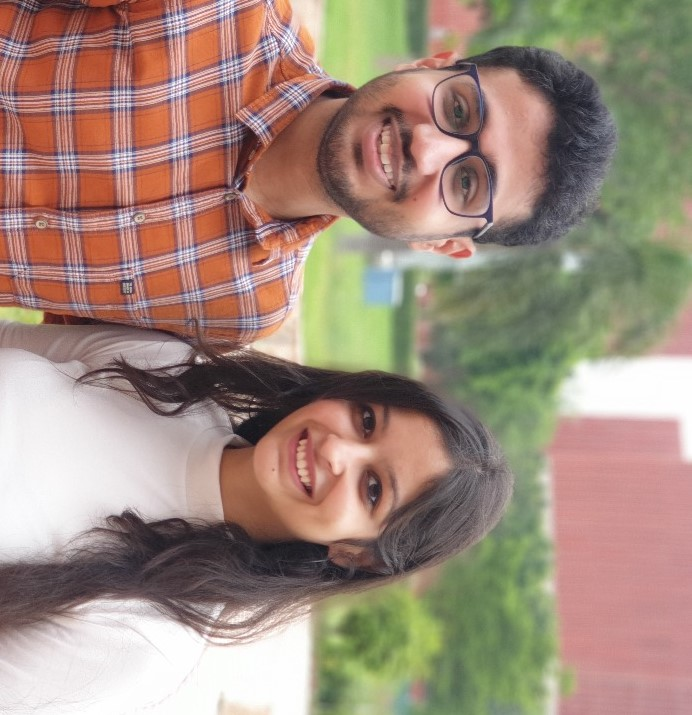
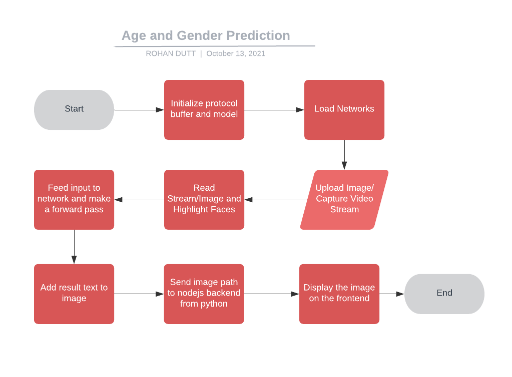

# UCS757:Building Innovative Systems
## Submitted by:-
### Rohan Dutt
### 101803151
### COE 8

# Projects
## Live Link
https://ucs757-101803151-projects.herokuapp.com

## Home

# Project 2: Age and Gender Detection 
## Introduction
The web app takes an image of a person as input and returns the image with the gender and age group details

## Requirements
1. Python
2. OpenCV-Python
3. NodeJS
4. EJS

## Live Link
https://ucs757-101803151-projects.herokuapp.com/age-gender

## Input Interface

## Input

## Output

## Flowchart

## Observations
1. The age groups 0-2, 4-6, 8-13 and 25-32 are predicted with relatively high accuracy. 
2. The output is heavily biased towards the age group 25-32 ( see the row belonging to the age group 25-32 ). This means that it is very easy for the network to get confused between the ages 15 to 43. So, even if the actual age is between 15-20 or 38-43, there is a high chance that the predicted age will be 25-32. 
3. We observed that the accuracy of the models improved if we use padding around the detected face. This may be due to the fact that the input while training were standard face images and not closely cropped faces that we get after face detection.

## Novelty
1. Detecting gender using an image, can also be extended to detect it in a video stream
2. Predicting the age group of all the individuals in an image
3. Using multiple build packs in Heroku for both Node.js and Python and experimenting with amazon ec2 for deployment  

## Limitation
This technique is limited with its efficiency in detecting age, it cannot detect exact age, and can only detect a certain age group. Also, unfortunately, it does not work on non binary genders yet.  
One can also try to use a regression model instead of classification for Age Prediction if enough data is available.
