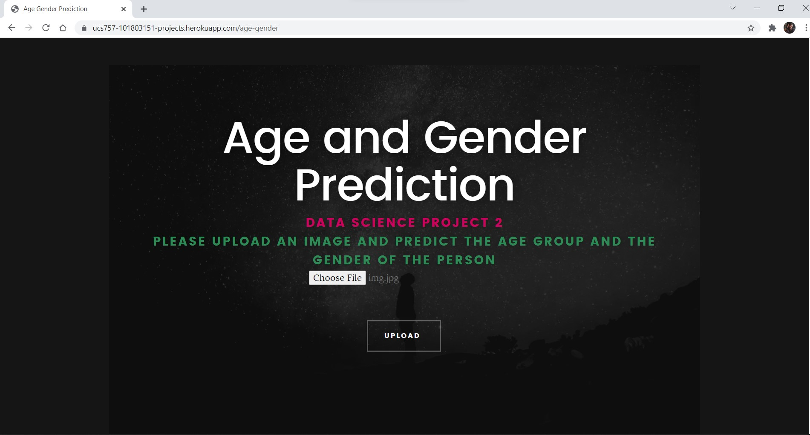
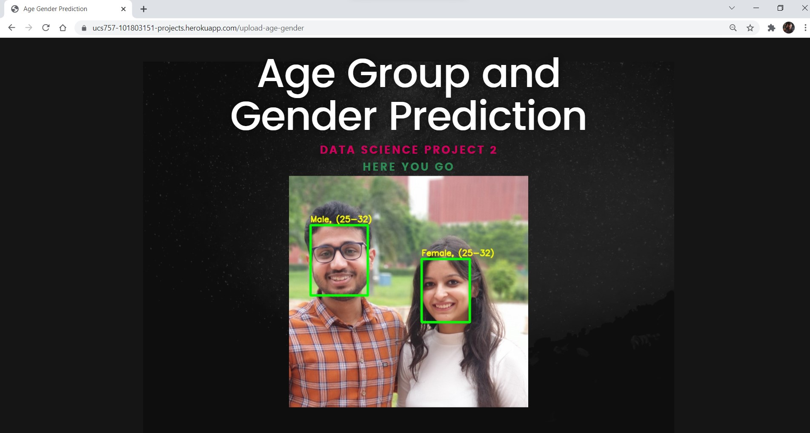
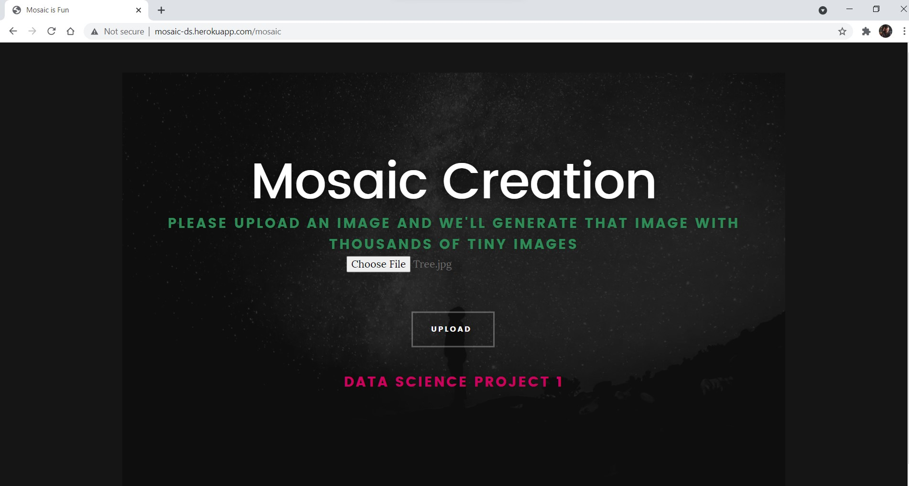
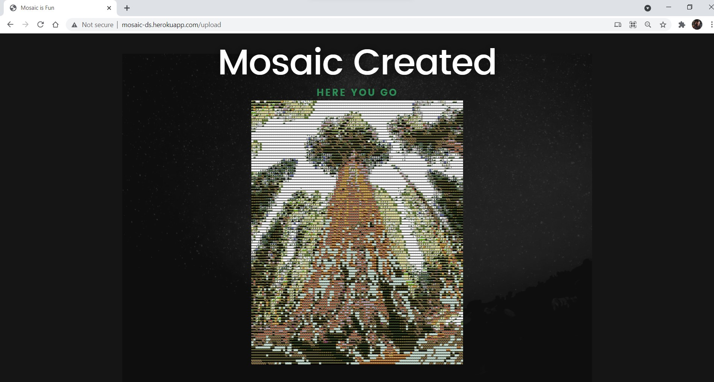

# UCS757:Building Innovative Systems
## Submitted by:-
### Rohan Dutt
### 101803151
### COE 8

# Projects
## Live Link
https://ucs757-101803151-projects.herokuapp.com

## Home

# Project 2: Age and Gender Detection 
## Introduction
The web app takes an image of a person as input and returns the image with the gender and age group details

## Requirements
1. Python
2. OpenCV-Python
3. NodeJS
4. EJS

## Live Link
https://ucs757-101803151-projects.herokuapp.com/age-gender

## Input Interface

## Input

## Output

## Flowchart

## Novelty
1. Generation of dataset for images(tiles), using extensions and small python scripts  
2. Finding nearest neighbour in terms of colors for each predefined unit of the target image from the data set tiles  
3. Randomization of images to ensure that maximum pixels are covered for each color   
4. Using multiple build packs in Heroku for both Node.js and Python and experimenting with amazon ec2 for deployment  

## Limitation
This technique is limited with its efficiency in detecting age, it cannot detect exact age, and can only detect a certain age group. Also, unfortunately, it does not work on non binary genders yet.

# Project 1: Mosaic Creator Using Node and Python
## Introduction
Mosaic creator is a web app which takes the target image as input and generates that image using thousands of small images

## Requirements
1. Python
2. NumPy
3. Pillow
4. NodeJS
5. EJS

## Live Link
https://ucs757-101803151-projects.herokuapp.com/mosaic

## Input Interface

## Input

## Output

## Flowchart

## Novelty
1. Generation of dataset for images(tiles), using extensions and small python scripts  
2. Finding nearest neighbour in terms of colors for each predefined unit of the target image from the data set tiles  
3. Randomization of images to ensure that maximum pixels are covered for each color   
4. Using multiple build packs in Heroku for both Node.js and Python and experimenting with amazon ec2 for deployment  

## Limitation
This technique is dependent on the variety of images in the dataset in terms of colors, higher the number of images in each color, better will be the mosaic.

